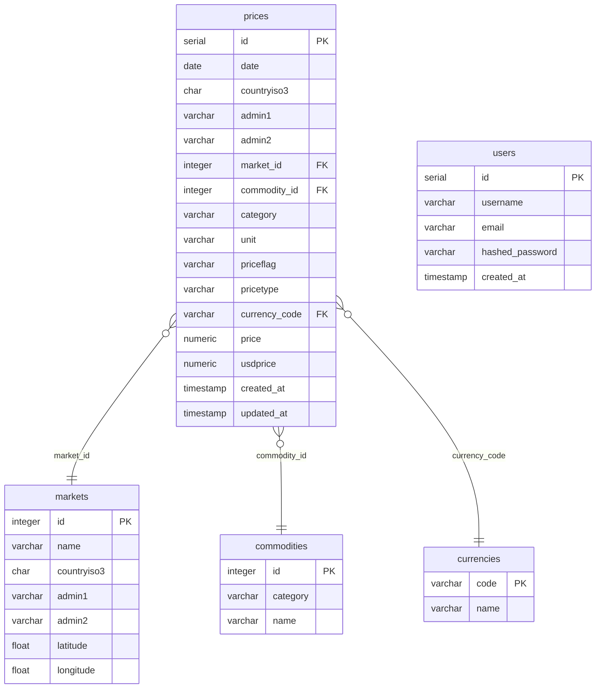

# Database Schema

The database uses PostgreSQL with five tables. `prices` is the central fact table; `markets`, `commodities`, and `currencies` are reference/dimension tables; `users` supports authentication.

## Entity Relationship Diagram

## Notes

- `prices.usdprice` is pre-computed at insert time to avoid repeated currency conversion at query time.
- Three composite indexes on `prices` target the most common analytical access patterns:
  - `(countryiso3, date)` — country-level time-series queries
  - `(commodity_id, date)` — commodity-level trend queries
  - `(market_id)` — market summary queries
- `users` is not linked to `prices`; it exists solely for JWT authentication.
